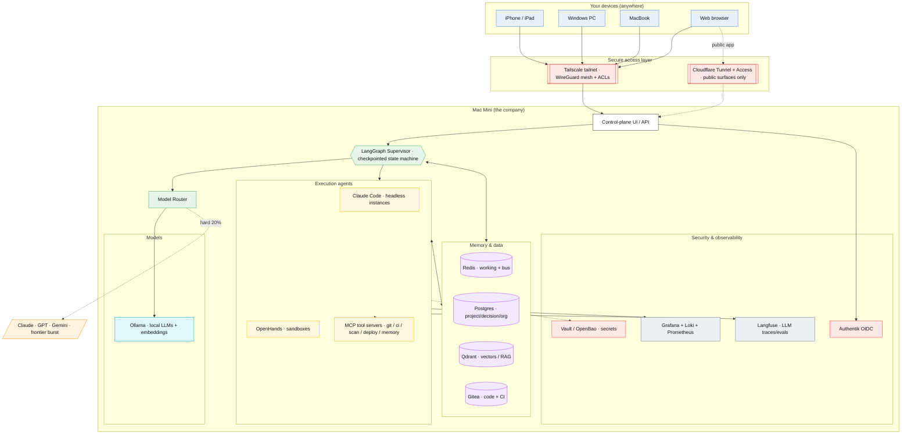

# 00 — Overview

> **Foundry** is a persistent, multi-agent **AI software company** that runs on a
> single Mac Mini, is reachable securely from any device, and can design, build,
> secure, ship, maintain, and market production-grade software with minimal
> supervision.

This document sets the mission, the design principles, and the system-level
picture. Read it first, then follow the reading order at the bottom.

---

## 1. Mission

Build a *company*, not a chatbot. The unit of work is a **project** (a product or
a feature), and the company carries it through a full software lifecycle —
idea -> requirements -> architecture -> design -> development -> security review ->
testing -> deployment -> monitoring -> marketing launch — using specialised agents
organised into real departments, coordinated by a durable orchestrator, and
remembering everything across sessions.

### Success criteria

| # | The company can... | Where it's delivered |
|---|---|---|
| 1 | Run entirely on a Mac Mini, with optional cloud burst | [01](01-infrastructure.md), [08](08-model-strategy.md) |
| 2 | Be reached securely from iPhone/iPad/Win/Mac/browser | [02](02-remote-access.md) |
| 3 | Run multiple concurrent projects | [05](05-orchestration.md) |
| 4 | Produce production-grade software | [09](09-dev-workflow.md) |
| 5 | Maintain long-term memory across restarts | [06](06-memory-system.md) |
| 6 | Field ~50 specialised expert agents | [03](03-org-structure.md), [04](04-agent-catalog.md) |
| 7 | Run real PM workflows with approvals | [05](05-orchestration.md), [10](10-autonomy-levels.md) |
| 8 | Operate with minimal supervision (dialable) | [10](10-autonomy-levels.md) |

---

## 2. Design principles

1. **Local-first, cloud-optional.** Default to local models for the 80% of work
   that doesn't need a frontier model; burst to Claude/GPT/Gemini for the hard
   20%. Never depend on the cloud to *function* — only to *excel*.
2. **Durable over chatty.** Agents coordinate through **durable shared state**
   (Postgres + Qdrant) and **typed messages**, not a free-form group chat. The
   orchestrator is a checkpointed state machine, so a crash or restart resumes
   exactly where it stopped.
3. **Memory is a first-class system, not a prompt.** Five memory classes, each in
   the right store, with an append-only decision log so the company never
   re-litigates settled questions.
4. **Capabilities, not vibes.** Every agent gets the *minimum* tools and memory
   access its mission requires. Security is enforced by the platform, not by
   asking the model nicely.
5. **Humans gate the irreversible.** Money, production deploys, external
   publishing, customer PII, secrets, and destructive ops are **hard gates** at
   every autonomy level.
6. **Cheapest-capable model wins.** A router sends each task to the smallest model
   that can do it well, and escalates only on evidence (low confidence, repeated
   failure, high stakes).
7. **Start small, grow deliberately.** The 56-agent org chart is the *destination*.
   Phase 1 ships ~6 agents. ([14](14-quality-control.md) argues this hard.)

---

## 3. System at a glance

**How a request flows:** you message the **Control-plane UI** over Tailscale ->
the **Chief of Staff** agent turns it into a brief -> the **LangGraph supervisor**
charters a project and walks it through the workflow stages -> each stage's owner
agent fans work out to specialists running as **Claude Code / OpenHands** workers
-> workers read/write **durable memory** and call **MCP tools** (git, CI, scanners,
deploy) -> the **router** sends each LLM call to the cheapest capable model ->
**hard gates** pause for your approval -> everything is **traced** (Langfuse) and
**audited** (Loki).

---

## 4. The four control systems

Foundry's behaviour is governed by four explicit, file-backed control systems —
this is what makes it a *company* and not a pile of prompts:

| System | Source of truth | Doc |
|---|---|---|
| **Org & agents** | `config/agents.yaml` -> `.claude/agents/*.md` | [03](03-org-structure.md), [04](04-agent-catalog.md) |
| **Orchestration & gates** | `config/orchestrator.yaml` | [05](05-orchestration.md), [10](10-autonomy-levels.md) |
| **Models & routing** | `config/models.yaml` | [08](08-model-strategy.md) |
| **Memory & retention** | `config/memory.yaml` | [06](06-memory-system.md) |

---

## 5. Glossary

- **Operator** — you, the human. The ultimate escalation target and gate approver.
- **Agent** — a role with a mission, bounded tools, memory access, and a model
  tier. Defined in `config/agents.yaml`.
- **Supervisor / Orchestrator** — the LangGraph state machine that runs projects.
- **Worker** — an execution runtime (Claude Code headless / OpenHands) that an
  agent's task actually runs inside.
- **Gate** — a checkpoint where execution pauses for human approval.
- **Tier** — an abstract model class (`local-small` ... `cloud-frontier`) resolved
  to a concrete model by the router.
- **ADR** — Architecture Decision Record; an entry in the append-only decision log.
- **Tailnet** — your private Tailscale (WireGuard) network.

---

## 6. Reading order

**[00 Overview](00-overview.md)** -> **[03 Org structure](03-org-structure.md)** ->
**[07 Tech stack](07-tech-stack.md)** -> **[05 Orchestration](05-orchestration.md)** ->
**[06 Memory](06-memory-system.md)** -> **[08 Models](08-model-strategy.md)** ->
**[02 Remote access](02-remote-access.md)** -> **[11 Security](11-security-architecture.md)** ->
**[09 Dev workflow](09-dev-workflow.md)** -> **[10 Autonomy](10-autonomy-levels.md)** ->
**[12 Deployment](12-deployment-plan.md)** -> **[13 Claude Code](13-claude-code-implementation.md)** ->
**[14 Quality control](14-quality-control.md)**.
