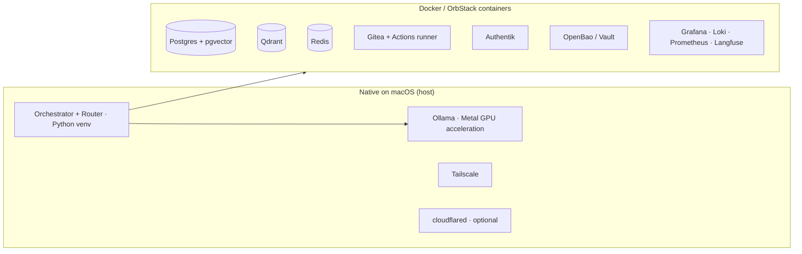

# 01 — Infrastructure

How Foundry physically runs on one Mac Mini: hardware sizing, what runs natively
vs. in Docker, storage layout, resource budgeting, and the service inventory.

---

## 1. Hardware sizing

Foundry is designed for **Apple-silicon Mac Mini**. Unified memory is the binding
constraint — it's shared between the OS, Docker services, *and* local LLMs.

| Mac Mini | Verdict | What you can run locally |
|---|---|---|
| M2/M4, **16 GB** | Minimum / dev only | `local-small` + one `local-mid:14b`; lean on cloud for the rest. Don't run heavy DBs + a 32B model together. |
| M4 / M4 Pro, **24–32 GB** | **Recommended start** | `local-small`, `local-mid:32b`, all platform DBs. Skip `local-large`; burst to cloud for hard reasoning. |
| M4 Pro/Max, **48–64 GB** | Comfortable | Add `local-large` (70B-q4) for offline architecture/reasoning; run more concurrent projects. |
| M4 Max, **128 GB** | Power | Multiple large models resident; 3+ concurrent heavy projects. |

**Storage:** 1 TB minimum, 2 TB recommended. Models alone are 50–150 GB; repos,
vector indexes, Postgres, backups, and Docker images add up fast. Prefer an
external NVMe (Thunderbolt) for the `data/` volume on smaller-SSD minis.

**The honest constraint:** a Mac Mini is a *capable single node*, not a cluster.
The realistic ceiling is **~3 concurrent projects** and **one heavy model
resident at a time**. [docs/14](14-quality-control.md) treats this as the central
scaling bottleneck and explains the cloud-burst and queueing mitigations.

---

## 2. What runs natively vs. in Docker

A deliberate split, because of Apple-silicon GPU access:



- **Ollama runs natively**, not in Docker. Docker Desktop on macOS does **not**
  pass through the Apple GPU, so a containerised LLM would run on CPU and be
  ~10x slower. Native Ollama gets full Metal acceleration.
- **Tailscale runs natively** (it's the network fabric; see [02](02-remote-access.md)).
- **The orchestrator runs natively** in a Python virtualenv for low-latency access
  to Ollama and the local sockets. (It *can* be containerised later for isolation;
  Phase 1 keeps it native for simplicity.)
- **Everything stateful runs in Docker** via `docker/docker-compose.yml`:
  Postgres, Qdrant, Redis, Gitea, Authentik, OpenBao, and the observability stack.
  Use **OrbStack** instead of Docker Desktop if you want lower memory overhead.

---

## 3. Storage layout

```
$FOUNDRY_DATA_DIR/                 # default ./data, ideally an external NVMe
├── postgres/                      # Postgres data dir (volume)
├── qdrant/                        # vector storage (volume)
├── redis/                         # redis persistence (volume)
├── gitea/                         # repos + CI artifacts (volume)
├── authentik/  vault/             # identity + secrets state (volumes)
├── models/                        # Ollama models (or ~/.ollama) — large!
├── workspaces/                    # per-project agent working trees (gitignored)
│   └── <project>/<repo>/...
├── checkpoints/                   # LangGraph durable checkpoints (gitignored)
└── backups/                       # nightly snapshots (see scripts/backup.sh)
```

The repo (this folder) holds **config and code**; `data/` holds **state**. They
are separable: you can wipe `data/` and rebuild from backups, or move it to a
bigger disk, without touching the repo.

---

## 4. Resource budgeting (the part people skip)

On a 32 GB mini you must *budget* RAM or the machine swaps and everything crawls.
Set container limits in compose and pick model sizes accordingly:

| Component | Budget (32 GB mini) |
|---|---|
| macOS + apps | ~6 GB |
| Ollama resident model (`local-mid:32b`, q4) | ~20 GB (only while in use) |
| Postgres + Qdrant + Redis | ~3–4 GB |
| Gitea + Authentik + Vault + observability | ~3–4 GB |
| Orchestrator + headroom | ~2 GB |

Implications, enforced by the **Infrastructure agent** and `config/orchestrator.yaml`:
- **One heavy model resident at a time** (`max_concurrent_heavy_models: 1`). The
  router queues heavy local calls; bursts to cloud rather than loading two 32B models.
- **Set Docker memory limits** so DBs can't balloon and starve the model.
- On 16–24 GB, drop `local-mid` to `:14b` and **don't** run `local-large` at all.

---

## 5. Service inventory

| Service | Role | Port (loopback) | Native/Docker |
|---|---|---|---|
| Ollama | Local LLMs + embeddings | 11434 | Native |
| Orchestrator API/UI | Control plane | 8800 | Native |
| Postgres (+pgvector) | System of record | 5432 | Docker |
| Qdrant | Vector DB / RAG | 6333 | Docker |
| Redis | Working memory + event bus | 6379 | Docker |
| Gitea (+Actions) | Git hosting + CI/CD | 3000 | Docker |
| Authentik | OIDC identity provider | 9000 | Docker |
| OpenBao / Vault | Secrets | 8200 | Docker |
| Langfuse | LLM tracing / evals | 3001 | Docker |
| Grafana | Dashboards | 3002 | Docker |
| Prometheus | Metrics | 9090 | Docker |
| Loki | Log aggregation / audit | 3100 | Docker |
| Neo4j (Phase 3+) | Knowledge graph | 7687 | Docker |

> All ports bind to **127.0.0.1** only. Nothing listens on a public interface;
> remote reach is exclusively via Tailscale/Cloudflare ([02](02-remote-access.md)).

---

## 6. Bootstrapping

`make bootstrap` (-> `scripts/bootstrap.sh`) performs first-time host setup:
installs Homebrew packages, Ollama, Docker/OrbStack and Tailscale (if missing),
pulls the local models from `config/models.yaml`, brings up the Docker services,
and initialises the databases. See [12 — Deployment plan](12-deployment-plan.md)
for the full, security-reviewed sequence.

---

## 7. Reliability on a single box

A single node is a single point of failure. Mitigations:
- **Auto-restart:** services run with `restart: unless-stopped`; a `launchd` plist
  keeps Ollama + the orchestrator up across reboots.
- **Checkpointing:** LangGraph persists state, so a crash resumes mid-project.
- **Backups:** nightly snapshot of Postgres/Qdrant/Neo4j, weekly **off-box** copy
  (another disk or an encrypted cloud bucket), with periodic **restore tests**.
- **Health checks:** `make health` (-> `scripts/healthcheck.sh`) verifies every
  dependency; the Infrastructure agent watches metrics and restarts/escalates.
- **Cloud failover (Phase 4):** if the mini dies, the Cloud Engineer agent can
  re-provision the platform from IaC + backups on a cloud host. Documented, not
  automatic.
