# 03 — Organisational Structure

The company org chart: departments, reporting lines, and how the structure maps
onto execution. Every agent's *full* spec (mission, I/O, authority, escalation,
tools, model, memory, examples) is in the **[generated catalog -> 04](04-agent-catalog.md)**;
this document is the map.

---

## 1. Org chart

```mermaid
flowchart TD
    OP([Operator / Human]):::human
    COS[Chief of Staff · front door + routing]:::exec

    OP --- COS
    OP --> CEO[CEO]:::exec

    CEO --> COO[COO]:::exec
    CEO --> CTO[CTO]:::exec
    CEO --> CISO[CISO]:::exec
    CEO --> CFO[CFO]:::exec

    COO --> PO[Product Owner]:::prod
    COO --> PM[Project Manager]:::prod
    COO --> LEGAL[Legal & Compliance]:::exec
    COO --> MKT[Marketing Director]:::mkt
    COO --> SUP[Support]:::cs
    PO --> BA[Business Analyst]
    PO --> CFB[Customer Feedback]:::cs
    PO --> UX[UX]:::design

    CTO --> CA[Chief Architect]:::eng
    CTO --> DEVOPS[DevOps]:::eng
    CTO --> QA[QA]:::eng
    CTO --> TW[Technical Writer]:::prod
    CTO --> NETARCH[Network Architect]:::net
    CA --> SA[Solution Architect]
    CA --> CR[Code Review]:::eng
    SA --> BE[Backend]:::eng
    SA --> FE[Frontend]:::eng
    SA --> WEB[Web]:::eng
    SA --> IOS[iOS]:::eng
    SA --> AND[Android]:::eng
    SA --> DESK[Desktop]:::eng
    SA --> API[API]:::eng
    SA --> DB[Database]:::eng
    DEVOPS --> CLOUD[Cloud Engineer]:::eng
    DEVOPS --> REL[Release Manager]:::eng
    DEVOPS --> INFRA[Infrastructure]:::net
    QA --> PERF[Performance Testing]:::eng
    TW --> DOCS[Documentation]:::prod

    CISO --> SECARCH[Security Architect]:::sec
    CISO --> NETSEC[Network Security]:::sec
    CISO --> PENTEST[Penetration Testing]:::sec
    CISO --> IDENT[Identity]:::sec
    CISO --> SECCOMP[Security Compliance]:::sec
    CISO --> THREAT[Threat Intelligence]:::sec
    CISO --> IR[Incident Response]:::sec

    NETARCH --> FW[Firewall]:::net
    NETARCH --> CNET[Cloud Networking]:::net

    UX --> UI[UI]:::design
    MKT --> BRAND[Branding]:::design
    BRAND --> GFX[Graphic Design]:::design

    MKT --> SEO[SEO]:::mkt
    MKT --> CONTENT[Content]:::mkt
    MKT --> SOCIAL[Social Media]:::mkt
    MKT --> MR[Market Research]:::mkt
    MKT --> GROWTH[Growth]:::mkt

    CFO --> FIN[Finance]:::fin
    CFO --> FCAST[Forecasting]:::fin
    CFO --> PRICE[Pricing]:::fin
    CFO --> ACCT[Accounting]:::fin

    SUP --> KB[Knowledge Base]:::cs

    classDef human fill:#111,color:#fff,stroke:#111
    classDef exec fill:#e6f4ea,stroke:#34a853,color:#111
    classDef prod fill:#e8f0fe,stroke:#4285f4,color:#111
    classDef eng fill:#fef7e0,stroke:#fbbc04,color:#111
    classDef sec fill:#fce8e6,stroke:#ea4335,color:#111
    classDef net fill:#e0f7fa,stroke:#00acc1,color:#111
    classDef design fill:#f3e8fd,stroke:#a142f4,color:#111
    classDef mkt fill:#fff3e0,stroke:#fb8c00,color:#111
    classDef fin fill:#ede7f6,stroke:#673ab7,color:#111
    classDef cs fill:#e8f5e9,stroke:#2e7d32,color:#111
```



> Solid lines are primary reporting. Several agents also have **dotted-line**
> relationships (e.g., Network Security advises Firewall; Branding advises UI;
> Legal advises Security Compliance) — captured in each agent's `escalation`
> field in [the catalog](04-agent-catalog.md).

---

## 2. Departments (9)

| Dept | Lead | Mandate | Agents |
|---|---|---|---|
| **Executive & Leadership** | CEO | Strategy, portfolio, risk appetite, arbitration | CEO, COO, CTO, CISO, CFO, Legal & Compliance, Chief of Staff |
| **Product & Delivery** | Product Owner | What to build & delivering it | Product Owner, Project Manager, Business Analyst, Technical Writer, Documentation |
| **Engineering** | CTO | Designing & building software | Chief Architect, Solution Architect, Backend, Frontend, Web, iOS, Android, Desktop, API, Database, DevOps, Cloud Engineer, QA, Performance Testing, Code Review, Release Manager |
| **Cybersecurity** | CISO | Securing everything; release veto | Security Architect, Network Security, Penetration Testing, Identity, Security Compliance, Threat Intelligence, Incident Response |
| **Networking & Infra** | Network Architect | Connectivity & platform | Network Architect, Firewall, Cloud Networking, Infrastructure |
| **Design** | UX | Experience & visual identity | UX, UI, Graphic Design, Branding |
| **Marketing** | Marketing Director | Awareness & growth | Marketing Director, SEO, Content, Social Media, Market Research, Growth |
| **Finance** | CFO | Money, budgets, pricing | Finance, Forecasting, Pricing, Accounting |
| **Customer Success** | Support | Keeping customers happy | Support, Knowledge Base, Customer Feedback |

**56 agents total** (including the Chief of Staff entry/routing agent). The exact
count and every spec is generated into [04 — Agent Catalog](04-agent-catalog.md)
from `config/agents.yaml`.

---

## 3. Three layers of authority

The org compresses into three decision layers, which the orchestrator uses for
escalation and conflict resolution ([05](05-orchestration.md)):

```
+----------------------------------------------------------+
|  STRATEGY   Operator > CEO > COO/CTO/CISO/CFO            |  <- charters, budgets,
|             (sets goals, budgets, risk & autonomy)       |     risk, vetoes
+----------------------------------------------------------+
|  MANAGEMENT Department leads + Product Owner + PM        |  <- plan, assign,
|             (turn charters into plans, resolve issues)   |     accept work
+----------------------------------------------------------+
|  EXECUTION  Specialists (engineers, designers, ...)      |  <- do the work,
|             (produce artifacts within a scoped task)     |     produce artifacts
+----------------------------------------------------------+
```

- **Down**: goals -> charters -> plans -> tasks -> artifacts.
- **Up**: artifacts -> review -> acceptance; blockers/risks escalate one layer at a
  time until resolved (or hit the operator).
- **Sideways**: peers coordinate through durable shared state, not chat.

---

## 4. Special powers & checks

A few roles hold deliberate, asymmetric authority — the company's checks and balances:

| Role | Special power | Check on it |
|---|---|---|
| **Operator** | Final say on everything; approves all hard gates | — (you're the human) |
| **CISO** | **VETO** on releases with unmitigated critical risk | Overridable only by the operator, logged as an ADR |
| **CFO** | Can **halt non-essential cloud spend** at budget breach | Operator can raise the cap |
| **CTO** | Co-owns the production deploy gate | Shares it with CISO; operator above both |
| **Product Owner** | Final say on product **scope/priority** | Bounded by the project charter (CEO) |
| **QA / Code Review / Perf** | Can **block merge/release** on quality | CTO can override quality bar disputes |
| **Legal & Accounting** | **Advisory only** | Material decisions require a *human* professional |

This separation prevents any single agent (or a runaway loop) from shipping
insecure code, overspending, or making binding legal/financial commitments
unilaterally.

---

## 5. How the org maps to the workflow

Departments aren't decoration — each owns specific **workflow stages**
([09](09-dev-workflow.md), `config/orchestrator.yaml`):

| Stage | Owning role | Dept |
|---|---|---|
| Intake | Chief of Staff | Executive |
| Requirements | Business Analyst (review: Product Owner) | Product |
| Architecture | Chief Architect (review: CTO) | Engineering |
| Design | UX (review: Product Owner) | Design |
| Development | Project Manager -> engineers | Engineering |
| Code Review | Code Review | Engineering |
| Security Review | Security Architect (veto: CISO) | Security |
| Testing | QA (veto: QA) | Engineering |
| Deployment | Release Manager (gate: CTO+CISO) | Engineering |
| Monitoring | DevOps | Engineering |
| Marketing launch | Marketing Director (gate: Operator) | Marketing |
