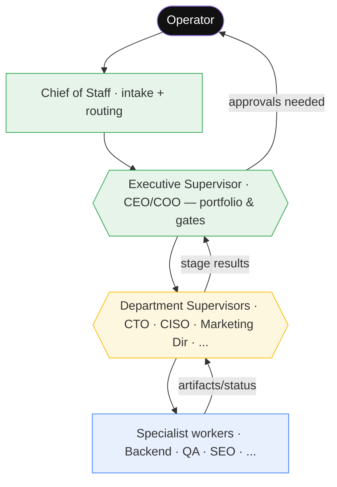
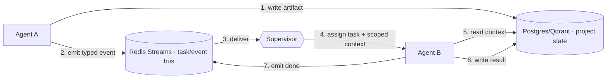
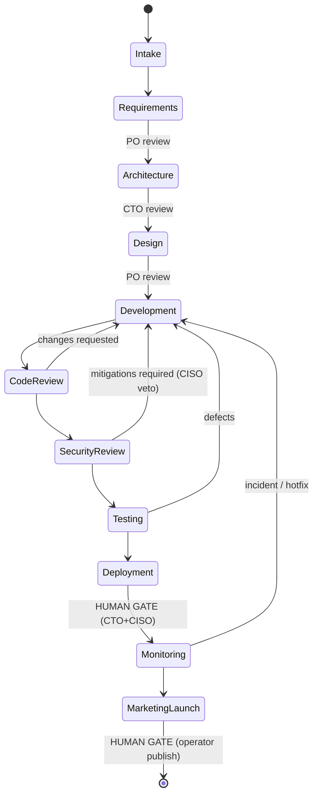
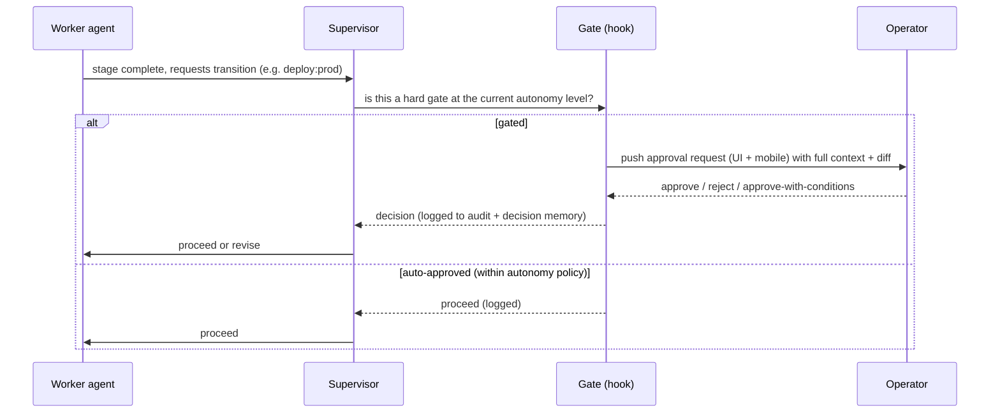
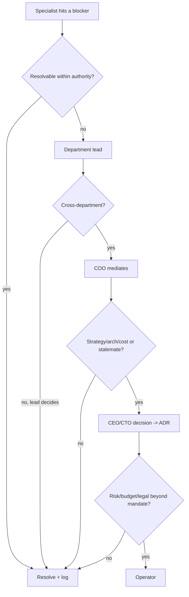
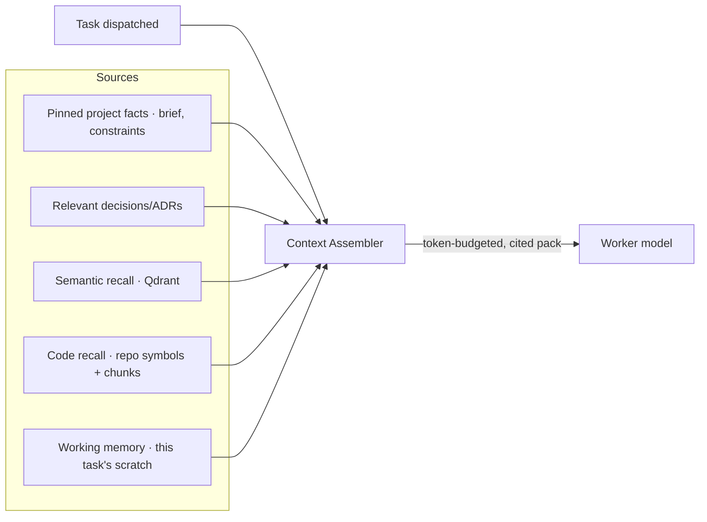

# 05 — Orchestration

How the company actually *runs*: the agent hierarchy, how agents communicate, how
work flows through a project, where humans approve, and how conflicts and
escalations resolve. The backbone is a **LangGraph supervisor** ([07](07-tech-stack.md))
governed by `config/orchestrator.yaml`.

---

## 1. Agent hierarchy (supervisor-of-supervisors)

Foundry uses a **hierarchical supervisor** pattern, not a free-for-all. Three
nested levels mirror the [org's authority layers](03-org-structure.md):

- **Executive supervisor** owns the *portfolio*: charters projects, allocates the
  scarce resources (heavy-model slots, concurrency), and owns company gates.
- **Department supervisors** own a *stage* of a project: they decompose it and
  dispatch to specialists, then review and accept the results.
- **Specialist workers** own a *task*: they run inside a Claude Code / OpenHands
  worker, produce a verifiable artifact, and report status.

Each level only sees what it needs (scoped context), which keeps token cost and
blast radius down.

---

## 2. Communication flow

> **Principle:** agents communicate through **durable shared state + typed
> messages**, never a free-form group chat. Every cross-agent message is a
> structured artifact persisted to memory — auditable, replayable, cheap.

1. An agent never "DMs" another agent. It **writes an artifact** (a design, a PR
   link, a verdict) to project state and **emits a typed event** on the bus.
2. The **supervisor** decides who acts next (per the workflow graph) and dispatches
   a task with **only the context that task needs** (assembled by RAG, see [06](06-memory-system.md)).
3. Results flow back the same way. The chat-style "transcript" is an *artifact of
   record*, not the coordination mechanism.

**Why:** deterministic, resumable, auditable, and far cheaper than N agents
re-reading a growing group chat every turn (the AutoGen failure mode).

---

## 3. Project workflow

A project is a path through the LangGraph state machine. Stages, owners, reviews,
and gates come from `config/orchestrator.yaml`:

- **Loop-backs** (CodeReview->Development, Testing->Development) do **not** need
  re-approval at autonomy Level >= 1 — only the **gates** do.
- Every transition is **checkpointed**; a restart resumes at the last node.
- Multiple projects run as **independent graph instances**, scheduled by the
  Executive supervisor within Mac-Mini limits (`max_concurrent_projects: 3`,
  `max_concurrent_heavy_models: 1`).

See [09 — Dev Workflow](09-dev-workflow.md) for the detailed per-stage activity.

---

## 4. Approval flow (human-in-the-loop gates)

- **Hard gates** (always human, every level): production deploy to customers,
  spending above cap, external publishing, customer-PII access, secret create/read,
  irreversible data ops, legal/financial commitments, anything targeting third
  parties. (`config/orchestrator.yaml -> hard_gates`.)
- Gates are enforced by **PreToolUse hooks** in `.claude/hooks/` and by the
  supervisor — *in code*, not by trusting the model. See [11](11-security-architecture.md).
- Approvals (and rejections, with reason) are written to the **decision log** so
  the company remembers *why*.

---

## 5. Escalation workflow

Blockers and risks climb the [authority ladder](03-org-structure.md) one rung at a
time until resolved or they reach the operator:

**Automatic escalation triggers** (don't wait for an agent to "decide" to escalate):
- A stage fails > 3 times -> pause project, alert operator (circuit breaker).
- A task exceeds `task_timeout_minutes` or `max_agent_loop_iterations` -> checkpoint
  + escalate (anti-runaway).
- CISO veto at the security gate -> only the operator can override.
- Cloud budget breach -> CFO halts cloud spend, falls back to local, alerts operator.

---

## 6. Conflict resolution workflow

When two agents disagree (e.g., Backend vs. Database on the schema, or CTO "ship"
vs. CISO "block"):

1. **Negotiate in shared state.** The disagreeing agents post a *proposal* and a
   *counter-proposal* as structured artifacts (not an argument loop). A bounded
   number of rounds (`max_agent_loop_iterations`).
2. **Lead decides.** If still unresolved, the relevant **department lead** picks,
   citing the trade-off; logged as an ADR.
3. **COO mediates** cross-department conflicts.
4. **Domain tie-breakers** (from `config/orchestrator.yaml`):
   - product -> **Product Owner**, technical -> **CTO**, money -> **CFO**,
     security -> **CISO (veto, not just tie-break)**, final -> **Operator**.
5. **Everything is logged** to the decision memory so the same fight never recurs —
   future agents read the ADR first ([06](06-memory-system.md)).

---

## 7. Context-sharing architecture

Agents don't share *everything* — they share the *right slice*, assembled per task:

- **Pinned facts + relevant ADRs are always included** so agents share the same
  ground truth and never re-litigate decisions.
- **Semantic/code recall** is retrieved on demand (hybrid search + rerank).
- **Working memory** is per-task and ephemeral (Redis, TTL).
- The assembler enforces a **token budget** and attaches **citations**, so outputs
  are traceable to sources. Details in [06 — Memory System](06-memory-system.md).

---

## 8. Memory architecture (pointer)

Orchestration and memory are joined at the hip: the supervisor reads/writes durable
state, and every artifact is a memory write. The five memory classes (working,
semantic, project, code, decision — plus customer & org) and the RAG pipeline are
specified in **[06 — Memory System](06-memory-system.md)**.
