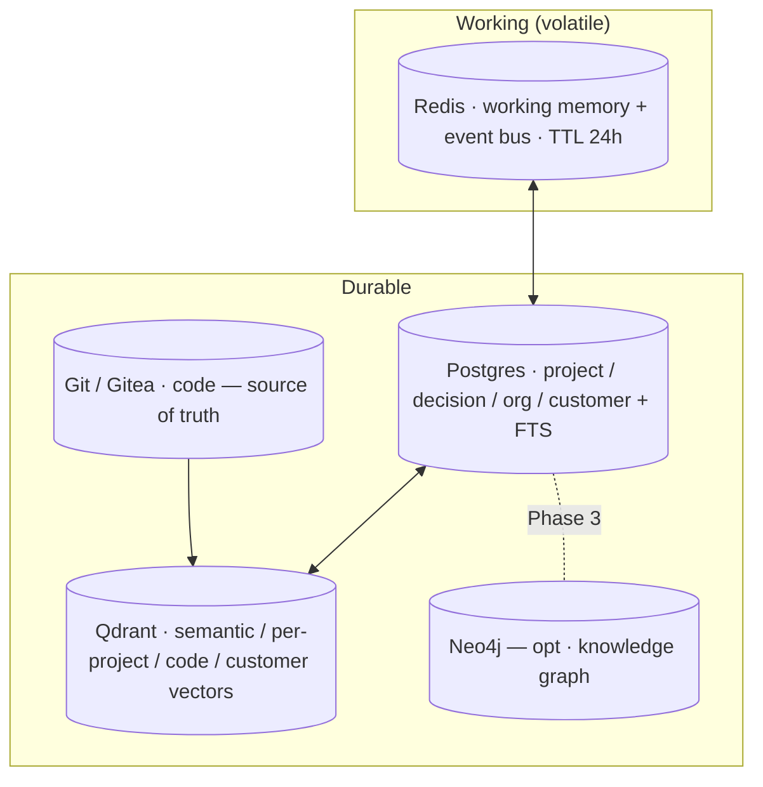
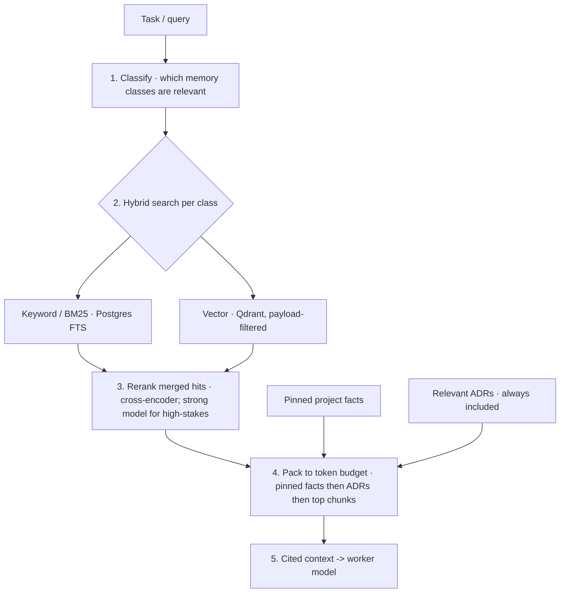

# 06 — Memory System

Memory is what turns 56 stateless model calls into a *company that remembers*.
Foundry treats memory as a first-class system with **five core classes** (plus
customer & org), each in the store that fits it, unified by a RAG retrieval layer.
Source of truth: `config/memory.yaml`.

---

## 1. The memory classes

| Class | Question it answers | Store | Lifetime |
|---|---|---|---|
| **Working (short-term)** | "What am I doing *right now*?" | Redis | task/session (24h TTL) |
| **Semantic (long-term)** | "What do we *know* generally?" | Qdrant | persistent |
| **Project** | "What's true about *this* project?" | Postgres + Qdrant | project life + archive |
| **Code** | "What does our *codebase* contain?" | Git + Qdrant | persistent, re-indexed on merge |
| **Decision (architecture)** | "*Why* did we choose this?" | Postgres (append-only) + Qdrant | **permanent** |
| **Customer** | "What do we know about this *customer*?" | Postgres + Qdrant | per retention/privacy law |
| **Org** | "What are our *policies/budgets*?" | Postgres | persistent, versioned |

### 1.1 Short-term (working) memory
Per-agent, per-task scratchpad in **Redis**: the current plan, intermediate
results, and in-flight tool outputs. TTL'd (24h or task completion). Redis Streams
also carry the **event bus** between agents ([05](05-orchestration.md)). Never the
system of record — it's allowed to vanish.

### 1.2 Long-term (semantic) memory & the Knowledge Base
Company-wide knowledge for RAG: internal docs, research findings, runbooks,
how-tos, and the **customer-facing knowledge base**. Chunked, embedded with
`nomic-embed-text`, stored in **Qdrant** (`knowledge` collection). The
**Documentation** and **Knowledge Base** agents own freshness — they re-index on
change and flag stale entries.

### 1.3 Project memory
Everything about one project: brief, requirements, user stories, status, tickets,
risks, and the project's own decisions. Structured rows live in **Postgres**;
free-text artifacts are embedded into a **per-project Qdrant collection** for
semantic recall. Pinned facts (the brief + hard constraints) are *always* injected
into agent context so the whole project shares ground truth.

### 1.4 Code memory
The codebase *is* memory. **Git/Gitea** is the source of truth; on every merge to
main, the DevOps pipeline re-indexes the repo into Qdrant (`code-<repo>`):
tree-sitter symbol extraction + chunked file embeddings + a file/path graph. This
lets any agent ask "where is X handled?" or "what calls this?" without re-reading
the whole tree.

### 1.5 Decision (architecture) memory — the most important one
An **append-only, hash-chained decision log** in Postgres holds every meaningful
decision as an **ADR**: context, options, choice, rationale, author, timestamp,
and what it supersedes. It is **never edited or deleted** — you supersede, you
don't erase. It's also embedded in Qdrant so agents can ask "have we decided this
before?" **This is what stops the company re-litigating settled questions** and
makes its behaviour coherent over months. Architecture decisions, security
trade-offs, conflict resolutions, and gate approvals all land here.

### 1.6 Customer memory (PII — special handling)
Accounts, tickets, feedback, voice-of-customer. Encrypted at rest; access is a
**hard gate** ([10](10-autonomy-levels.md)); data is minimised and subject to
retention/deletion per Legal & Compliance. Not all agents can read it — only
Support, Customer Feedback, and (scoped) Product/Growth.

### 1.7 Org memory
Org chart, policies, budgets, SLAs, and the live autonomy config. Versioned in
Postgres; this is the company's "constitution" that the supervisor consults.

---

## 2. Vector database recommendation

**Qdrant** is the primary vector store. Why over the alternatives:

| Option | Verdict |
|---|---|
| **Qdrant** | Fast, Rust, runs great in one Docker container on the mini; rich payload filtering (filter by project/repo/recency), hybrid search, named vectors, quantisation to save RAM. Scales from laptop to cluster. |
| **pgvector** | Already have Postgres — great for *small/medium* and for keeping vectors next to relational data. Use it for low-volume collections (org/decision). For high-volume code/semantic recall, Qdrant's filtering + performance win. **We use both.** |
| **Chroma** | Easiest to start; weaker at scale, filtering, and ops maturity. |
| **Weaviate / Milvus** | Powerful but heavier than a single-node Mac Mini warrants. |

> **Decision (ADR-worthy):** Qdrant for high-volume semantic/code/project vectors;
> pgvector for low-volume vectors that benefit from living beside relational rows.

Embeddings: **`nomic-embed-text`** (768-dim, local, fast) by default; upgrade to
`mxbai-embed-large` (1024-dim) for higher-quality semantic recall if RAM allows.
Keep the embedding model **fixed per collection** — changing it means re-embedding.

---

## 3. RAG architecture

Retrieval is **not** "dump the vector top-k into the prompt." It's a pipeline that
assembles a **token-budgeted, cited** context tailored to the task:

1. **Classify** the query to the relevant classes (a code task pulls `code` +
   project ADRs; a marketing task pulls `semantic` + `customer`).
2. **Hybrid search**: combine keyword (Postgres full-text) and vector (Qdrant with
   payload filters like `project=X`, `recency>90d`) — hybrid beats either alone.
3. **Rerank** the merged candidates; for high-stakes tasks, rerank with a strong
   model.
4. **Pack** within a token budget: **pinned facts first, then relevant ADRs, then
   the top reranked chunks** — so ground truth and prior decisions always make it
   in.
5. **Cite**: every injected chunk carries its source, so outputs are traceable and
   the operator can audit *why* an agent said what it said.

**Defaults** (`config/memory.yaml`): `top_k_vector: 12`, `top_k_keyword: 12`,
`final_context_chunks: 8`, `always_include: [pinned_project_facts, relevant_ADRs]`.

---

## 4. Write policy (what gets remembered)

- **Write durable facts and decisions, not raw chat transcripts.** Transcripts are
  noise; facts and ADRs are signal. (This is also a major cost saver.)
- **Every decision** -> the append-only decision log, with author + rationale.
- **Code memory** re-embeds on merge to main (pipeline hook), so recall matches
  reality.
- **Customer writes** are minimised, access-gated, and retention-bound.
- Agents **check the decision log before deciding** — enforced by always-injecting
  relevant ADRs into context.

---

## 5. Retention, privacy & durability

| Data | Policy |
|---|---|
| Working memory | 24h TTL |
| Audit logs | 365d hot in Loki -> cold archive |
| Customer PII | minimise; delete on request; honour legal retention; encrypted at rest |
| Decision log | **permanent** (supersede, never delete) |
| Backups | nightly snapshot of Postgres + Qdrant (+ Neo4j); **weekly off-box** copy; periodic **restore tests** |

Backups are run by `scripts/backup.sh` and owned by the **Infrastructure** agent.
A memory system you can't restore is a liability, so restores are *tested*, not
assumed.

---

## 6. Knowledge graph (optional, Phase 3+)

For questions that are fundamentally about *relationships* — "which projects depend
on library X, which has CVE Y, and who decided to adopt it?" — a **Neo4j**
knowledge graph links entities (project <-> dependency <-> CVE <-> decision <-> owner).
It's off by default (`graph.enabled: false`); turn it on when relationship queries
become common enough to justify the operational weight.
