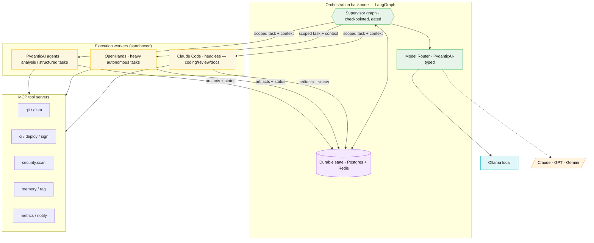

# 07 — Technical Stack

Which agent framework runs the company, and how it fits with the rest of the
stack. The headline: **no single framework is the whole answer.** Foundry uses a
**two-layer architecture** — a durable orchestration backbone with best-in-class
coding agents as workers.

---

## 1. Framework comparison

| Framework | Model | Strengths | Weaknesses | Role in Foundry |
|---|---|---|---|---|
| **LangGraph** | Graph / state machine of nodes & edges, with checkpointing | Durable, resumable, **deterministic control flow**; human-in-the-loop built in; persistence; great for long, gated, multi-stage workflows | More code than "role" frameworks; you design the graph | **Orchestration backbone** |
| **CrewAI** | Role/task "crews" | Fast to prototype role-based teams; readable | Higher-level abstractions leak; less control over durable state & gates; weaker for long-running, resumable flows | Optional rapid prototyping of a new department |
| **AutoGen** (AG2) | Conversational multi-agent (group chat) | Strong agent-to-agent **conversation** patterns, code execution | "Group chat" coordination is hard to make deterministic/auditable; token-hungry | Patterns borrowed, not the backbone |
| **OpenHands** (ex-OpenDevin) | Autonomous software-engineer agent in a **sandbox** | Excellent at *actually doing* end-to-end coding tasks in an isolated runtime; browser+shell+editor | A worker, not an org orchestrator; needs supervision/guardrails | **Execution worker** (heavy coding) |
| **PydanticAI** | Type-safe agent/tool definitions | **Typed** I/O, validation, clean tool calls, model-agnostic; lightweight | Not an orchestrator; you bring the workflow | **Typed tool/agent layer** inside nodes |
| **Semantic Kernel** | Plugin/skill orchestration (.NET-first, Python too) | Enterprise patterns, planners, connectors | Heavier, .NET-centric ecosystem; less idiomatic for a Python+Mac local stack | Not selected |
| **Claude Code (headless)** | Agentic coding CLI/SDK with subagents, hooks, MCP, skills | Best-in-class **coding agent**; native subagents, permission hooks, MCP tools, runs local or cloud models; *this repo already speaks it* | Anthropic-model-oriented for its own loop | **Primary execution worker** |

---

## 2. Why not "just pick one"

- **A role framework alone (CrewAI/AutoGen)** makes a *demo* fast but struggles
  with the things that make this a *company*: durable state across restarts,
  hard human-approval gates, deterministic escalation, and auditability. Free-form
  agent group-chat is hard to make safe, cheap, and reproducible.
- **An autonomous coder alone (OpenHands)** is a brilliant *worker* but isn't an
  organisation — no portfolio, no gates, no cross-department workflow, no memory
  architecture.
- **The orchestration problem and the coding problem are different problems.** Use
  the right tool for each.

---

## 3. The recommended architecture: Supervisor + Workers

**Division of labour:**

- **LangGraph = the company OS.** It models the project lifecycle as a graph:
  nodes are workflow stages / agent roles, edges are transitions (including
  loop-backs and approval gates). It **checkpoints** every step to Postgres, so the
  company survives restarts and can be paused at a human gate and resumed.
- **PydanticAI = typed glue.** Inside graph nodes, agent calls and tool calls are
  defined with Pydantic models so inputs/outputs are **validated and structured**
  (not free-text), and the model provider is swappable (Ollama <-> Claude).
- **Claude Code (headless) = the primary engineer.** This repo already defines all
  agents as `.claude/agents/*.md`. A node can dispatch a scoped task to a headless
  Claude Code run with the right subagent, tools (via MCP), and permission hooks.
- **OpenHands = the heavy-lifting sandbox.** For large, multi-file, autonomous
  coding tasks that benefit from a full sandboxed dev environment, dispatch to
  OpenHands with a bounded task + acceptance tests.
- **MCP tool servers = the hands.** Git, CI/CD, scanners, deploy, memory/RAG,
  metrics, notifications — all exposed as MCP tools, so both Claude Code and the
  orchestrator use one consistent, permissioned tool layer.

> **Why this is the right call for a Mac Mini, one operator:** you get
> determinism, durability, and hard gates from LangGraph; you get the best coding
> agents (Claude Code/OpenHands) as workers; PydanticAI keeps the seams typed and
> model-agnostic so you can run local or cloud per task. It is more work than a
> CrewAI demo — and that's the point: this optimises for a *capable, maintainable,
> secure* company, not for the shortest hello-world.

---

## 4. Full stack summary

| Layer | Choice | Alternatives considered |
|---|---|---|
| Orchestration | **LangGraph** | CrewAI, AutoGen, Semantic Kernel |
| Typed agent/tool layer | **PydanticAI** | LangChain core, raw SDKs |
| Execution workers | **Claude Code (headless)** + **OpenHands** | Aider, SWE-agent, Devin |
| Tool integration | **MCP** servers | Bespoke function calling |
| Local model serving | **Ollama** (native, Metal) | LM Studio, llama.cpp, vLLM (Linux/GPU) |
| Embeddings | **nomic-embed-text** (Ollama) | mxbai-embed-large, bge |
| Relational store | **Postgres** (+ pgvector) | SQLite (too small), MySQL |
| Vector store | **Qdrant** | pgvector-only, Chroma, Weaviate, Milvus |
| Working memory / bus | **Redis** (Streams) | NATS, RabbitMQ |
| Knowledge graph (opt) | **Neo4j** | Memgraph, none |
| Git + CI/CD | **Gitea + Actions** (self-host) | GitHub + Actions, Forgejo |
| Identity | **Authentik** (OIDC) | Keycloak, Authelia |
| Secrets | **OpenBao / HashiCorp Vault** | 1Password Connect, Infisical, macOS Keychain |
| Reverse proxy (internal) | **Caddy** | Traefik, nginx |
| Remote access | **Tailscale** (+ Cloudflare Tunnel) | WireGuard, OpenVPN — see [02](02-remote-access.md) |
| LLM observability | **Langfuse** | LangSmith, Phoenix |
| Metrics/logs/dash | **Prometheus + Loki + Grafana** | Datadog (paid), ELK |
| Containers | **Docker / OrbStack** | Podman |
| Language | **Python 3.12** (orchestrator) + TS (any UI) | — |

See [08 — Model Strategy](08-model-strategy.md) for which model runs which task,
and [13 — Claude Code Implementation](13-claude-code-implementation.md) for how
this maps onto Claude Code specifically.
