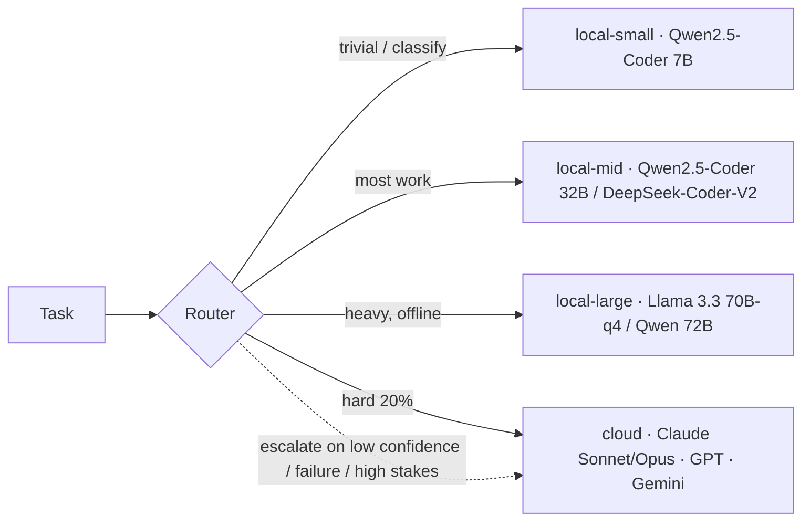

# 08 — Model Strategy

Which model does which job, local vs. cloud, and the router policy that picks the
**cheapest model that can do the task well**. Source of truth: `config/models.yaml`.

---

## 1. Principle: tiered, cheapest-capable-first

Most agent work — routine coding, docs, summarising, triage, analysis — does **not**
need a frontier model. Foundry routes the **~80%** to local models on Ollama (free,
private, Metal-accelerated) and **bursts the hard ~20%** (deep architecture,
security review, ambiguous reasoning, final code review) to frontier cloud models.

---

## 2. The model field, compared

| Model family | Where it shines | Run it... | Foundry use |
|---|---|---|---|
| **Claude** (Opus 4.8, Sonnet 4.6, Haiku 4.5) | Best-in-class agentic **coding**, careful **reasoning**, **security/code review**, long-horizon tasks; strong instruction-following & tool use | Cloud (primary burst) | **Primary cloud tier.** Opus = architecture/security/final review; Sonnet = strong reasoning/review; Haiku = fast cloud when local is busy |
| **GPT** (frontier) | Strong general reasoning, broad tooling/ecosystem, good function calling | Cloud | **Fallback** for cloud-reasoning/frontier if Anthropic is unavailable |
| **Gemini** (frontier) | **Huge context windows**, strong multimodal, good research synthesis | Cloud | **Long-context research** & multimodal review fallback |
| **DeepSeek** (Coder-V2, V3, R1) | Excellent **coding**; **R1** = strong open **reasoning**; great price/perf | Local (distills) or cloud | Local coding alt; **R1-distill** for offline reasoning; cheap cloud reasoning |
| **Qwen2.5-Coder** (7B/14B/32B) + Qwen 72B | Top open **coding** models at their sizes; 32B rivals much larger; long ctx | **Local (Ollama)** | **Local-small & local-mid workhorse** — the default for coding |
| **Llama 3.3 70B** / 3.2 (3B, vision) | Strong general 70B; tiny 3B for routing; vision variants | **Local (Ollama)** | **local-large** (offline reasoning/arch) + local-small (3B routing) |
| **Mistral** (Codestral, Small, Mixtral) | Efficient; **Codestral** is coding-focused; permissive | Local | Alt local coder / lightweight tasks |
| **Other OSS coders** (StarCoder2, CodeLlama, etc.) | Niche/legacy | Local | Situational; Qwen-Coder/DeepSeek generally better today |

> Concrete pins live in `config/models.yaml` and should be refreshed as new
> releases land — the *strategy* (tiering + routing) is stable; the *pins* are not.

---

## 3. Model allocation by task

Each agent declares a `model: {primary, fallback}` tier in `config/agents.yaml`.
The mapping by **kind of work**:

| Work | Primary (local) | Escalation (cloud) | Rationale |
|---|---|---|---|
| **Architecture** | local-large (Llama 3.3 70B / Qwen 72B) | **Claude Opus** (cloud-frontier) | High stakes, long-horizon reasoning -> frontier earns its cost; local-large only if offline/cost-bound |
| **Coding** (impl) | **local-mid** (Qwen2.5-Coder 32B / DeepSeek-Coder-V2) | Claude Sonnet | 80% of code is well within a 32B coder; escalate the gnarly 20% |
| **Reasoning** (analysis, trade-offs) | local-large / DeepSeek-R1-distill | Claude Opus/Sonnet | R1-distill gives decent offline reasoning; frontier for the hard calls |
| **Security** (review, threat model) | local-mid (routine scans) | **Claude Opus** | Security review is exactly where a frontier model pays for itself |
| **Research** | local-mid + web | **Gemini** (long-context synth) / Claude | Large-context synthesis of many sources |
| **Planning** (PM, decomposition) | local-mid | Claude Sonnet | Structured, mostly local; escalate ambiguous scoping |
| **UI design** | Claude Sonnet (multimodal) | Claude Opus + image models | Vision helps compare mockups; pair with image gen (below) |
| **Documentation / content** | **local-mid** (Qwen2.5-Coder 32B) | Claude Sonnet | Local writes the bulk; cloud polishes high-visibility copy |
| **Routing / triage / classify** | **local-small** (Qwen 7B / Llama 3B) | — | Must be cheap & instant; never burn cloud on routing |
| **Embeddings (RAG)** | `nomic-embed-text` (local) | — | Local, fast, fixed per collection |
| **Image generation** | local SDXL/Flux endpoint | cloud image API | Not an LLM tier — exposed via the `image.generate` MCP tool |

Mapped to agents: the C-suite + architects + security leads sit on **cloud-frontier**;
the engineers/designers/marketers default to **local-mid**; routing/KB/triage sit on
**local-small**. (See the `model` column in [04 — Agent Catalog](04-agent-catalog.md).)

---

## 4. Router policy

The router (a typed PydanticAI component in `orchestrator/router`) starts at the
agent's `primary` tier and **escalates on evidence** (`config/models.yaml -> router`):

**Escalate when:**
- self-reported confidence < 0.6, or
- the task is tagged high-risk (security review, prod architecture, payments), or
- 2 consecutive tool/test failures on the same step, or
- code-review returns *request-changes* twice on the same PR, or
- the operator explicitly asks for a stronger model.

**De-escalate:** routine retries/follow-ups stay on the cheapest tier that worked.

**Offline / budget-exhausted:** cloud tiers map **down** to `local-large` so the
company keeps functioning (degraded, not dead).

---

## 5. Cost governance

- **Daily cap** (`CLOUD_DAILY_BUDGET_USD`) is a hard circuit breaker enforced by the
  router and watched by the **CFO** agent. On breach: stop new cloud calls, finish
  in-flight, fall back to local, alert the operator.
- **Cache** aggressively: prompt/result caching for repeated context; reuse retrieval
  results within a task.
- **Right-size**: don't send a 32B-sized job to Opus. The router's whole purpose is
  to prevent this.
- **Track per project**: Langfuse traces every LLM call (tokens, latency, cost, tier)
  so Finance can attribute spend per project and flag waste.

---

## 6. Hardware-aware presets

| Mac Mini RAM | local-small | local-mid | local-large | Reasoning |
|---|---|---|---|---|
| 16 GB | Qwen 7B | Qwen-Coder **14B** | none (use cloud) | DBs + a 14B coder is the ceiling; cloud for the rest |
| 24–32 GB | Qwen 7B | Qwen-Coder **32B** | none (use cloud) | The recommended default |
| 48–64 GB | Qwen 7B | Qwen-Coder 32B | **Llama 3.3 70B-q4** | Offline architecture/reasoning becomes viable |
| 128 GB | Qwen 7B | Qwen-Coder 32B | 70B + a second resident model | Multiple heavy projects |

Set these in `config/models.yaml`; the router and Infrastructure agent enforce
"one heavy model resident at a time" so you never thrash swap.
