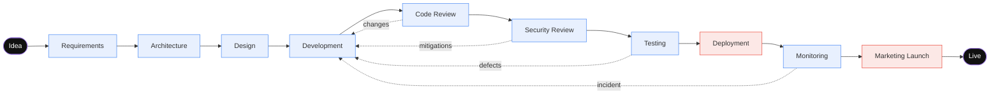
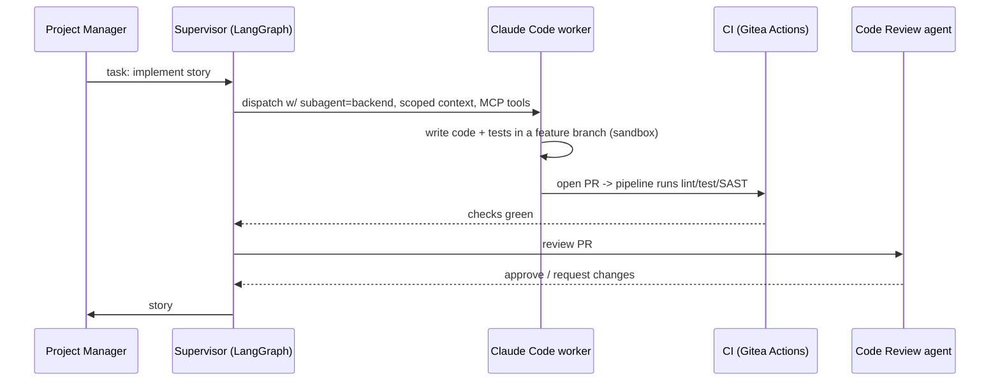

# 09 — Software Development Workflow

The end-to-end pipeline the company executes to turn an idea into a launched,
monitored, marketed product. Each stage names its **owner**, **inputs**,
**outputs**, **memory writes**, and **gate** (if any). Driven by the LangGraph
graph in `config/orchestrator.yaml`.

---

## 1. The pipeline

GATE = human gate (Deployment, Marketing Launch). Loop-backs (dotted) don't need
re-approval at autonomy Level >= 1.

---

## 2. Stage by stage

### 0. Intake — *Chief of Staff*
- **In:** operator's idea/goal (free text). **Out:** a structured **project brief**
  (problem, target user, success criteria, constraints, rough scope).
- **Memory:** creates the project record (org + project). **Gate:** none — but the
  CEO charters the project (portfolio fit, budget, autonomy level) before work
  starts.

### 1. Requirements — *Business Analyst* (review: *Product Owner*)
- **In:** brief, market research. **Out:** functional + non-functional requirements,
  **user stories with acceptance criteria**, edge cases.
- **Memory:** project (requirements), semantic. **Gate:** none; PO reviews.

### 2. Architecture — *Chief Architect* (review: *CTO*)
- **In:** requirements, tech radar, NFRs. **Out:** system + component design,
  data model sketch, interface contracts, and an **ADR per major decision**.
- **Memory:** **decision (ADRs)**, code, project. **Gate:** none; CTO reviews.
- **Model:** cloud-frontier (this is where frontier reasoning pays off).

### 3. Design — *UX* -> *UI* (review: *Product Owner*; brand: *Branding*)
- **In:** stories, brand kit. **Out:** user flows, wireframes -> hi-fi mockups +
  component specs the Frontend can implement 1:1.
- **Memory:** project, semantic. **Gate:** none; PO reviews.

### 4. Development — *Project Manager* -> engineers
- **In:** specs, contracts, designs. The PM decomposes into tasks and fans out to
  **Backend / Frontend / Web / iOS / Android / Desktop / API / Database** as needed.
  **Out:** code + tests in feature branches, PRs that pass CI.
- **Memory:** code, project (status/tickets). **Gate:** none at Level >= 1 for
  non-main branches; merge to **main** is gated at Level 1.
- **Model:** local-mid workhorse; escalate gnarly tasks to cloud.

### 5. Code Review — *Code Review agent* (escalate: *Chief Architect*)
- **In:** PR diff, standards, ADRs. **Out:** review verdict (approve / request
  changes), inline comments, security smells flagged to Security.
- **Memory:** code, decision. **Gate:** **blocks merge** until approved. Two
  *request-changes* rounds -> router escalates the author to a stronger model.

### 6. Security Review — *Security Architect* (**veto: CISO**)
- **In:** design + diff, threat model, dependency manifest. **Out:** STRIDE threat
  review, required controls, SAST/DAST/dependency/secret scan results
  (*Penetration Testing* runs scans on **owned assets only**).
- **Memory:** decision, project, code. **Gate:** **CISO veto** on unmitigated
  critical/high findings — loops back to Development with required mitigations.

### 7. Testing — *QA* (perf: *Performance Testing*; **veto: QA**)
- **In:** acceptance criteria, builds. **Out:** E2E/integration/regression suites,
  defect reports, load/soak results, **quality verdict**.
- **Memory:** code, project, decision. **Gate:** **QA can block** for failing the
  quality bar or performance budgets; loops back on defects.

### 8. Deployment — *Release Manager* (**gate: CTO + CISO**)
- **In:** green gates from CR/Sec/QA. **Out:** semver tag, changelog, **signed**
  artifacts (+ notarisation for macOS apps), staged -> production deploy.
- **Memory:** code, decision, org. **Gate:** **HARD** — production deploy to
  customers always needs human approval (CTO + CISO; operator above them).
- **DevOps** runs the pipeline: lint -> test -> SAST -> build -> **sign** -> deploy
  -> smoke test, with one-command rollback.

### 9. Monitoring — *DevOps* (+ *Infrastructure*, *Incident Response*)
- **In:** running service. **Out:** dashboards, alerts, SLO tracking; on anomaly,
  **Incident Response** runs the playbook and can loop back to a hotfix.
- **Memory:** project, decision (post-incident ADRs). **Gate:** none; incidents
  with user-data/legal impact escalate to the operator immediately.

### 10. Marketing Launch — *Marketing Director* (**gate: Operator**)
- **In:** shipped product, positioning, brand. **Out:** GTM plan executed across
  **SEO / Content / Social / Growth**; landing page (*Web*); launch assets
  (*Graphic Design*).
- **Memory:** project, customer, semantic. **Gate:** **HARD** — any **external
  publishing** (social posts, blog go-live, store listing) requires operator
  approval. Drafts are produced autonomously; *publishing* is gated.

### (Ongoing) Customer Success & Feedback loop
- **Support** fields tickets (KB-assisted); **Knowledge Base** turns recurring
  tickets into self-serve docs; **Customer Feedback** clusters the voice-of-customer
  and routes demand back to the **Product Owner** — feeding the next idea. The loop
  closes.

---

## 3. Where the work physically happens

Tasks run inside **sandboxed workers** (Claude Code headless / OpenHands), each
given only the tools and context its task needs. The **supervisor** never lets a
worker skip a gate.

---

## 4. A worked example: "Build a habit-tracker app"

1. **Intake:** Chief of Staff -> brief (target: iOS-first, offline, freemium).
2. **CEO** charters it: Level 1 autonomy, $10/day cloud cap.
3. **Requirements:** BA writes stories (streaks, reminders, sync). PO trims v1 scope.
4. **Architecture:** Chief Architect (Opus) -> local-first store + sync service;
   ADRs for the sync conflict strategy and the datastore choice.
5. **Design:** UX flows -> UI hi-fi screens + design tokens.
6. **Dev:** PM fans out -> iOS (SwiftUI) + Backend (sync API) + Database (schema) +
   API (contract). Local-mid models write most code; the sync-conflict logic
   escalates to Sonnet.
7. **Code Review** blocks a PR with a race condition -> loops back -> fixed.
8. **Security Review:** Security Architect requires Keychain + cert pinning; Pentest
   scans the API. CISO clears it.
9. **Testing:** QA E2E happy path + failure modes; Perf load-tests the sync API.
10. **Deployment** (gate): you approve. Release Manager tags v1.0.0, signs/notarises
    the iOS build, ships to TestFlight; DevOps deploys the API.
11. **Monitoring:** dashboards + alerts live.
12. **Marketing Launch** (gate): Marketing Director's plan; Content writes the post,
    Social drafts launch tweets — **you approve before anything publishes**.
13. **Feedback loop:** Support + Feedback agents start learning from real users;
    demand flows back to the PO for v1.1.

Every decision above is an **ADR**; every gate is **logged**; the whole run is
**checkpointed** and resumable.
