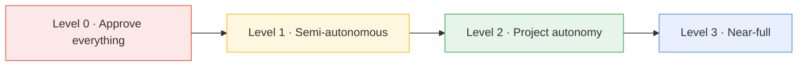
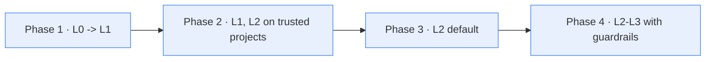

# 10 — Autonomy Levels

How much the company may do without asking you. Set globally via
`FOUNDRY_AUTONOMY_LEVEL` and overridable per project. Defined in
`config/orchestrator.yaml -> autonomy`. **Hard gates apply at every level.**

---

## 1. The levels at a glance

| Level | Name | Auto (no ask) | Always gated |
|---|---|---|---|
| **0** | Approve everything | *nothing* | plan, code, merge, deploy, spend, publish, data, secrets |
| **1** | Semi-autonomous | plan, code, test, **merge non-main** | merge->main, deploy, spend>budget, publish, data, secrets |
| **2** | Project autonomy | plan, code, test, merge, **deploy->staging**, spend<=budget | deploy->prod, publish, spend>budget, prod data, secrets, legal |
| **3** | Near-full (policy-bounded) | all of L2 + **prod deploy (low-risk)**, **publish (low-risk)** | spend>budget, bulk prod data, new secrets, legal, irreversible, new project |

---

## 2. What each level *means* in practice

### Level 0 — Approve everything
The company **proposes**, you **dispose**. Every plan, every code change, every
merge waits for your click. It's a co-pilot.
- **Use when:** brand-new setup, a sensitive project, or you're still building trust.
- **Feel:** safest, slowest. You are the bottleneck (by design).

### Level 1 — Semi-autonomous *(recommended default)*
Agents plan, write code, run tests, and merge to **feature branches** on their own.
They stop for you at the things that matter: merging to **main**, **any deploy**,
**spending over budget**, **publishing**, **touching data/secrets**.
- **Use when:** normal operation for most projects. Good balance of speed and control.
- **Feel:** the company does the work; you approve the consequential moments.

### Level 2 — Project autonomy (within a charter)
Inside a **chartered project** with a defined scope and budget, agents run the whole
inner loop *including deploys to **staging*** and spending **up to** the budget,
escalating only at the project's edges (prod deploy, publish, over-budget, prod
data, legal).
- **Use when:** a project is well-understood and you trust the guardrails.
- **Feel:** you set direction + budget, then review at milestones and hard gates.

### Level 3 — Near-full (policy-bounded)
The company self-directs across the portfolio and may even do **low-risk production
deploys** and **low-risk publishing** under policy, escalating only on genuinely
high-stakes events (over-budget, bulk prod data, new secrets, legal, irreversible
ops, opening a *new* project).
- **Use when:** mature setup, strong evals/observability, proven track record.
- **Feel:** you supervise a company, not tasks. **Not a Phase 1 setting.**

> **"Low-risk" is policy-defined, not vibes.** A deploy/publish counts as low-risk
> only if it meets explicit criteria (e.g., no schema change, behind a feature flag,
> reversible in one command, below an audience threshold). Anything else is gated.

---

## 3. Risks of each level

| Level | Primary risks | Mitigations (built in) |
|---|---|---|
| **0** | **You become the bottleneck**; approval fatigue -> rubber-stamping; throughput collapses; you stop reading what you approve | Use only briefly; graduate to L1 once trust is built |
| **1** | A bad merge to a feature branch; wasted local compute on a wrong path; over-eager refactors | Code review gate; loop limits; checkpoints make rollback cheap; main is still gated |
| **2** | **Scope creep** within a project; **budget burn** up to the cap; a bad **staging** deploy; subtle defects shipped to staging | Charter scope + budget cap; staging != prod; QA/sec gates; circuit breakers; per-project Langfuse cost tracking |
| **3** | **Compounding small autonomous actions** into a big mistake; **low-risk misclassification** (something risky slips through as "low-risk"); harder to audit after the fact; emergent multi-agent behaviour | Strict policy definition of "low-risk"; hard gates still absolute; full audit log + traces; kill-switch; **start lower and earn L3** |

**Cross-cutting risks at any level** (see [14](14-quality-control.md) & [11](11-security-architecture.md)):
- **Prompt injection** via web research / external content steering an agent ->
  egress allowlists, capability jails, content treated as untrusted.
- **Runaway loops** burning compute/money -> iteration caps, timeouts, circuit breakers.
- **Hallucinated confidence** -> router escalation on low confidence + independent
  review gates.

---

## 4. Hard gates are absolute (all levels)

No autonomy level can bypass these (`config/orchestrator.yaml -> hard_gates`):

1. Production deploy that reaches customers
2. Spending money above the cap
3. Publishing external content (social, blog, store listings)
4. Accessing or moving customer **PII**
5. Creating or reading **new secrets**
6. Irreversible data operations (drops, deletes, prod migrations)
7. Signing legal/financial commitments
8. **Any action targeting third-party systems**

These are enforced in **code** (supervisor + PreToolUse hooks), not by trusting the
model to behave. Even at Level 3, these stop and wait for you.

---

## 5. Recommendation & graduation path

- **Start at Level 0** for your first project to watch the company work, then move
  to **Level 1** quickly (Level 0 is exhausting and breeds rubber-stamping).
- **Level 1 is the right default** for most operation.
- **Graduate a *specific project* to Level 2** once you trust its scope and gates.
- **Only consider Level 3** in Phase 4, after you have **evals, full observability,
  a proven track record, and a kill-switch** — and even then keep hard gates absolute.
- **Always keep a kill-switch:** `make down` + revoke agent credentials halts
  everything. The autonomy dial should be easy to turn *down* fast.
