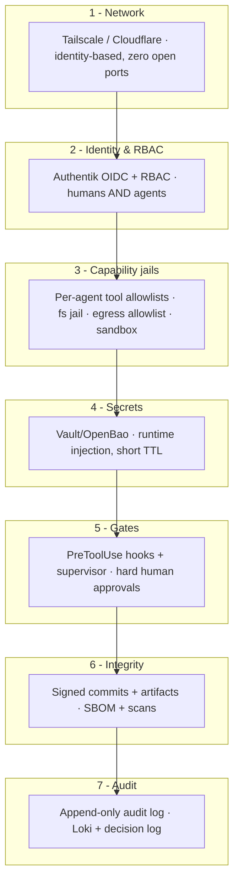

# 11 — Security Architecture

Foundry runs agents that can execute code, move data, and spend money on a box that
holds your secrets and customer data. Security is therefore **enforced by the
platform**, not requested of the model. Defense in depth, least privilege, and hard
human gates on the irreversible.

---

## 1. Authentication

- **Network layer:** Tailscale (WireGuard) identity for the operator plane;
  Cloudflare Access (SSO+MFA) for public surfaces. No service is internet-exposed.
  ([02](02-remote-access.md).)
- **Application layer:** every control-plane request authenticates via **Authentik
  (OIDC)** — even *on the tailnet*. Network access != app access.
- **MFA everywhere**, device authorization on, **Tailscale tailnet lock** so a
  compromised coordination server can't inject nodes.
- **Agents authenticate too:** each agent runs under its own **service account** /
  OIDC client with a scoped token — not a shared "god" credential.

---

## 2. RBAC (humans *and* agents)

Roles are defined in org memory and enforced at the API and tool layers. The
**Identity** agent owns the model; the **operator** is the only superuser.

| Subject | Can | Cannot |
|---|---|---|
| Operator (you) | Everything; approve gates | — |
| Agent: engineer | Read/write its repos, run CI, open PRs | Deploy to prod, read secrets, touch PII |
| Agent: security | Read all code, run scans on owned assets, **veto releases** | Modify prod, exfiltrate data |
| Agent: marketing | Draft content, read product/customer-aggregate | **Publish** (gated), read raw PII |
| Agent: finance | Read usage/cost metrics, write budgets | Move money, change prod |
| Device: phone (operator) | UI + dashboards + approve gates | Reach DB/secret ports |

**Principle of least privilege** is the rule: an agent's grants must not exceed its
mission. The Identity agent runs periodic access reviews and strips over-broad grants.

---

## 3. Agent permissions (capability jails)

Each agent is boxed three ways, so a misbehaving or hijacked agent has a small blast
radius:

1. **Tool allowlist.** The agent only gets the tools its role needs. In Claude Code
   this is the `tools:` frontmatter (generated from `config/agents.yaml`) plus
   `.claude/settings.json` `permissions.allow/deny`. Domain tools (deploy, sign,
   secrets) are MCP servers that *themselves* enforce authz.
2. **Filesystem jail.** Workers run in a **per-project workspace** (`workspaces/<proj>`),
   not the whole disk. No agent can read `~/.ssh`, the secrets store, or another
   project's tree.
3. **Network egress allowlist.** Research/web tools can only reach allowlisted hosts.
   This is the main defense against **data exfiltration** and is enforced by the
   Network Security/Firewall agents' rules — *not* by asking the model not to leak.
4. **Sandboxed execution.** Code runs in containers / `sandbox-exec` with CPU/mem/time
   limits and `restart`/kill policies (anti-runaway).

### Prompt-injection defense
Web pages, repo issues, dependency READMEs, and customer messages are **untrusted
input**. Mitigations: treat external content as data not instructions; egress
allowlists so an injected "exfiltrate to evil.com" can't connect; tool allowlists so
injected instructions can't reach tools the agent doesn't have; hard gates so even a
fully-hijacked agent can't deploy/spend/publish without you.

---

## 4. Secrets management

- **Never in the repo, never long-lived in `.env`.** `.env` holds non-secret config
  and pointers; real secrets live in **OpenBao / HashiCorp Vault** (or 1Password
  Connect / macOS Keychain for the smallest setups).
- **Runtime injection only:** the orchestrator fetches a short-TTL secret from Vault,
  hands it to the worker for the call, and it's gone — not persisted to disk or memory.
- **Reading/creating a new secret is a HARD GATE** (every autonomy level).
- **Secret scanning** in CI (`security.scan`) blocks any commit that contains a
  credential; the Pentest agent also scans repos/history.
- **Rotation:** Vault leases + scheduled rotation; ephemeral Tailscale/Cloudflare keys.

---

## 5. Approval gates

Hard gates are enforced in **code**, two ways that must *both* allow an action:
1. **Supervisor** checks the action against `hard_gates` + current autonomy level
   before transitioning.
2. **PreToolUse hooks** (`.claude/hooks/approval_gate.py`) intercept the actual tool
   call (deploy, spend, publish, secret, PII, destructive op, third-party target)
   and block until the operator approves via the UI/mobile.

This double-enforcement means a model that "decides" to skip the workflow still can't
fire a gated tool. See [10 — Autonomy Levels](10-autonomy-levels.md).

---

## 6. Code signing & supply-chain integrity

- **Signed commits:** agents sign commits (Sigstore **gitsign** or GPG); CI rejects
  unsigned commits to main. Provenance: every commit is attributable to an agent
  service identity.
- **Signed artifacts:** releases are signed; macOS apps are **codesigned + notarised**
  (`codesign` + `notarytool`) by the Release Manager at the deploy gate.
- **SBOM + scanning:** generate an SBOM (`syft`) and scan deps/images (`grype`/`trivy`)
  every build; Threat Intelligence maps new CVEs to our SBOM and sets patch urgency.
- **Pinned dependencies + lockfiles**, reviewed by Legal (licences) and Security
  (vulns) before adoption — defense against dependency-confusion / typosquatting.

---

## 7. Audit logging

- **Every** tool call, model call, gate decision, and login is logged as a
  **structured event** (who/what/when/why/result) shipped to **Loki**.
- **Append-only:** the security-relevant audit stream and the **decision log**
  (Postgres, hash-chained) cannot be edited — only appended/superseded.
- **Traceable AI:** Langfuse records every LLM call (prompt, tier, tokens, cost,
  latency) so you can reconstruct *why* an agent did something.
- **Retention:** 365 days hot, then cold archive. Audit + traces are how you
  investigate an incident or a surprising bill.

---

## 8. Remote-access security (summary)

Covered in depth in [02](02-remote-access.md): zero inbound ports; Tailscale identity
+ ACLs for the operator plane; Cloudflare Tunnel + Access for public surfaces; DBs
and secrets never on any client-reachable ACL; MFA + device auth + key rotation; two
auth layers (network **and** application).

---

## 9. Incident response

When something goes wrong, the **Incident Response** agent runs the playbook
(triage -> contain -> eradicate -> recover) under CISO direction, maintains the
timeline, and drives a **blameless post-incident review** that produces ADRs and
prevention actions. Breaches with user-data/legal impact escalate to the **operator
immediately**. Runbooks live in semantic memory and are kept current.

---

## 10. Security checklist (operator)

- [ ] Tailscale MFA + device authorization + tailnet lock enabled
- [ ] No router port-forwards; all services bound to 127.0.0.1
- [ ] Authentik OIDC enforced on the control plane; agents have per-role service accounts
- [ ] Vault/OpenBao holds all secrets; `.env` has no real secrets; secret scanning on
- [ ] Per-agent tool allowlists + workspace jails + egress allowlists in place
- [ ] Hard gates verified (try to deploy/spend/publish -> must prompt you)
- [ ] Signed commits enforced on main; releases signed + (macOS) notarised
- [ ] Audit logs flowing to Loki; Langfuse tracing on; backups restore-tested
- [ ] Kill-switch rehearsed (`make down` + revoke tokens)
