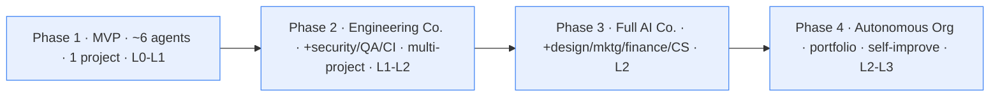

# 12 — Deployment Plan

Four phases from a working MVP to a multi-project autonomous organisation. Each
phase is independently *useful* — you get value at the end of Phase 1, not Phase 4.
**Resist booting all 56 agents on day one** (see [14](14-quality-control.md)).



---

## Phase 0 — Host prerequisites (one-time)

On the Mac Mini (Apple silicon, 32 GB+ recommended):

```bash
# Install Homebrew, then:
brew install --cask orbstack          # or Docker Desktop
brew install ollama python@3.12 node tailscale caddy
brew install --cask cloudflared       # only if you'll publish public surfaces

ollama serve &                        # native, Metal-accelerated
tailscale up                          # join your tailnet, enable MFA + device auth
```

Then clone the repo and configure:
```bash
git clone <repo> foundry && cd foundry
cp .env.example .env                   # fill non-secrets; real secrets go in Vault
python3 -m venv .venv && source .venv/bin/activate
pip install -r requirements.txt        # orchestrator deps (Phase 1 skeleton)
```

---

## Phase 1 — MVP (the smallest thing that's a *company*)

**Goal:** one project, idea -> tested code -> staged deploy, with real gates and memory.

**Agents (6 + router):** `chief-of-staff`, `product-owner` (doubling as PM/BA),
`chief-architect`, `backend`, `qa`, `devops`. Add `code-review` if you can afford it.

**Services:** Ollama (local-small + local-mid), Postgres, Qdrant, Redis, Gitea,
Tailscale, Caddy. (Skip Authentik/Vault/observability if you must — but add Vault
before any real secrets exist.)

**Autonomy:** Level 0 -> graduate to Level 1 within the first project.

**Steps:**
```bash
make bootstrap        # installs tools, pulls models, inits DBs
make agents           # generate the subagents you enable (trim config or use a profile)
make up               # postgres, qdrant, redis, gitea
make models           # pull qwen2.5-coder:7b + :32b (or :14b), nomic-embed-text
make run              # start the orchestrator
make health           # verify everything is green
```

**Definition of done:** you can message the Chief of Staff "build X", watch it move
through requirements -> architecture -> code -> review -> test -> **staging deploy
(gated)**, and the company **remembers** the project + decisions after a restart.

---

## Phase 2 — Engineering company

**Goal:** multiple concurrent projects, real CI/CD, and the security + quality gates
that make output *production-grade*.

**Add agents:** `solution-architect`, `frontend`/`web`/`ios`/`android`/`desktop`
(as your products need), `api`, `database`, `cloud-engineer`, `release-manager`,
`performance-testing`, plus the **security core**: `ciso`, `security-architect`,
`penetration-testing`, `identity`.

**Add services:** **Authentik** (OIDC/RBAC), **OpenBao/Vault** (secrets),
**Gitea Actions** runners (CI), the **observability stack** (Prometheus/Loki/Grafana
+ Langfuse), and **signing** (gitsign + notarytool).

**Autonomy:** Level 1 default; Level 2 on a trusted project. Up to
`max_concurrent_projects: 3`.

**New capabilities:** full code-review + security-review + testing + signed-deploy
gates; per-project cost tracking; backups (`make backup`) restore-tested.

**Definition of done:** two projects run at once; every release passes CR + security
+ QA gates and ships **signed** artifacts; a crash mid-project resumes from checkpoint.

---

## Phase 3 — Full AI company

**Goal:** a real *business*, not just engineering — design, marketing, finance,
customer success, legal.

**Add agents:** Design (`ux`, `ui`, `graphic-design`, `branding`), Marketing
(`marketing-director`, `seo`, `content`, `social-media`, `market-research`, `growth`),
Finance (`cfo`, `finance`, `forecasting`, `pricing`, `accounting`), Customer Success
(`support`, `knowledge-base`, `customer-feedback`), and `legal-compliance`,
`technical-writer`, `documentation`, `business-analyst`, `project-manager`,
`network-architect`, `firewall`, `cloud-networking`, `infrastructure`,
`network-security`, `security-compliance`, `threat-intelligence`,
`incident-response`, `coo`, `ceo`. (This is the full 56.)

**Add services:** image generation endpoint (SDXL/Flux) for design; **n8n** for
business automations (alerts, digests, cross-tool glue); **Neo4j** if relationship
queries warrant it; **Cloudflare Tunnel + Access** for shipped public products.

**Autonomy:** Level 2 default. The full workflow incl. **marketing launch** (publish
gate) and the **customer feedback loop** is live.

**Definition of done:** the company can take an idea all the way to a **launched,
marketed, supported** product, with finance tracking spend/unit-economics and
feedback feeding the next iteration — you approving only the hard gates.

---

## Phase 4 — Multi-project autonomous organisation

**Goal:** the company runs a *portfolio* with minimal supervision and improves itself.

**Add capabilities (not just agents):**
- **Portfolio management:** the CEO/COO supervisors schedule and rebalance multiple
  projects against shared Mac-Mini resources + budget; **cloud burst** (Cloud
  Engineer) for overflow when the mini is saturated.
- **Cost governance at scale:** CFO enforces per-project budgets + forecasts; the
  router optimises tier usage continuously.
- **Self-improvement loops:** the company runs **evals** on its own output (Langfuse
  datasets), retros produce ADRs, and the Documentation/KB agents keep institutional
  memory sharp. (Human-reviewed — no unbounded self-modification.)
- **Resilience:** documented cloud failover (re-provision platform from IaC + backups
  if the mini dies); chaos drills owned by Infrastructure/IR.

**Autonomy:** Level 2-3 with **hard gates still absolute**, full audit + traces, and
a rehearsed **kill-switch**. Level 3 only after a proven track record.

**Definition of done:** several products run and evolve concurrently; the operator
supervises *the company* (priorities, budgets, gates) rather than tasks; the system
survives restarts, budget limits, and a node failure.

---

## Cross-phase: what you always have

| Concern | From Phase | Mechanism |
|---|---|---|
| Memory persistence | 1 | Postgres + Qdrant + checkpoints |
| Remote access | 1 | Tailscale |
| Hard gates | 1 | Supervisor + hooks |
| Secrets in Vault | 2 (before any real secret) | OpenBao/Vault |
| RBAC/identity | 2 | Authentik |
| CI/CD + signing | 2 | Gitea Actions + gitsign/notarytool |
| Observability | 2 | Prometheus/Loki/Grafana + Langfuse |
| Backups (restore-tested) | 2 | `scripts/backup.sh` |
| Kill-switch | 1 | `make down` + token revocation |

> **A note on "profiles":** to enable a subset of agents per phase without deleting
> registry entries, gate each agent with an `enabled_in_phase` field (or a profile
> list) and have `generate_agents.py` emit only the active set. The full spec stays
> in `config/agents.yaml`; you just light up what the phase needs.
