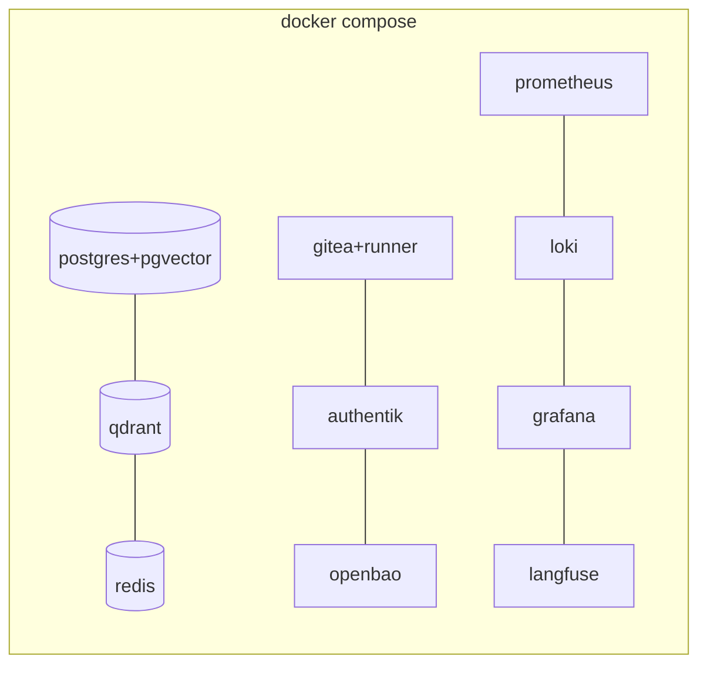

# 13 — Claude Code Implementation

How the architecture maps onto **Claude Code** specifically — because this repo
*is* a Claude Code project. Folder structure, config files, subagents, hooks, MCP
wiring, Docker, startup, env, Git strategy, and monitoring.

---

## 1. Folder structure

```
foundry/
├── README.md
├── Makefile                       # operator entrypoints (make help)
├── .env.example                   # every env var, documented
├── .gitignore
├── requirements.txt               # orchestrator Python deps
│
├── docs/                          # the architecture (00-14)
│   └── diagrams/
│
├── config/                        # SINGLE SOURCES OF TRUTH (yaml)
│   ├── agents.yaml                # the org: every agent + spec
│   ├── models.yaml                # tiers + routing policy
│   ├── orchestrator.yaml          # graph, gates, autonomy, budgets
│   └── memory.yaml                # memory classes + RAG + retention
│
├── .claude/                       # Claude Code project config
│   ├── settings.json              # permissions, hooks, MCP, env
│   ├── agents/                    # GENERATED subagents (one per agent)
│   │   └── *.md
│   └── hooks/                     # gate + audit enforcement (Python)
│       ├── approval_gate.py       # PreToolUse: block hard-gated tools
│       └── audit_log.py           # PostToolUse: append-only audit
│
├── orchestrator/                  # LangGraph supervisor (Python skeleton)
│   ├── main.py                    # entrypoint (make run)
│   ├── graph/                     # the project state machine
│   ├── router/                    # model router (tiers -> models)
│   └── workers/                   # dispatch to Claude Code / OpenHands
│
├── services/memory/               # memory service skeleton (FastAPI + MCP)
│
├── docker/
│   └── docker-compose.yml         # postgres, qdrant, redis, gitea, authentik...
│
├── scripts/
│   ├── bootstrap.sh  start/stop   # lifecycle
│   ├── generate_agents.py         # registry -> subagents + catalog
│   ├── pull_models.sh             # ollama models per config
│   ├── healthcheck.sh  backup.sh  # ops
│
├── monitoring/                    # prometheus/loki/grafana/langfuse config
│
└── data/                          # (gitignored) all runtime state + volumes
```

> The repo holds **config + code**; `data/` holds **state**. Generated files
> (`.claude/agents/*.md`, `docs/04`) come from `config/agents.yaml` — never hand-edit.

---

## 2. Subagents — the org as Claude Code agents

Every agent in `config/agents.yaml` becomes a real Claude Code **subagent** at
`.claude/agents/<key>.md` via `make agents`. Each has valid frontmatter:

```yaml
---
name: backend
description: Build robust, well-tested server-side logic... Use for: ...
tools: Read, Grep, Glob, Write, Edit, Bash    # least-privilege built-ins
model: sonnet                                 # tier -> haiku/sonnet/opus
---
You are the Backend Agent at Foundry...  (mission, authority, escalation,
memory access, example tasks, operating rules incl. hard gates)
```

- **`tools:`** is the least-privilege built-in allowlist for that role. Domain
  capabilities (git, deploy, scan, memory) are **MCP tools** (below), documented in
  the body and themselves authz-enforcing.
- **`model:`** maps the LangGraph tier to a Claude Code model (`local-mid`->sonnet,
  `cloud-frontier`->opus, `local-small`->haiku). In the *local* execution path the
  same tier resolves to an Ollama model via `config/models.yaml`.
- **`description:`** doubles as the routing hint the supervisor uses to pick an agent.

This means you can drive the whole company **directly from Claude Code** (delegating
to subagents) *and* from the LangGraph orchestrator (which dispatches headless Claude
Code runs) — same agent definitions, one source of truth.

---

## 3. `.claude/settings.json`

Wires up permissions, the gate/audit hooks, MCP servers, and model defaults. Key
parts (full file in the repo):

- **`permissions.allow/deny`** — a coarse safety net beneath per-agent `tools:`.
  Deny dangerous Bash by default (`rm -rf`, `curl | sh`), allow the safe toolset.
- **`hooks.PreToolUse`** -> `approval_gate.py`: intercepts hard-gated tools (deploy,
  spend, publish, secrets, PII, destructive, third-party) and **blocks for human
  approval** — enforcement in code, not vibes.
- **`hooks.PostToolUse`** -> `audit_log.py`: appends every tool call to the audit log.
- **`mcpServers`** — the Foundry tool layer (next section).

> Note: hook scripts must exist before the hooks are wired, or Claude Code will
> block tool calls on the missing script. `make bootstrap` places them; the repo
> ships them under `.claude/hooks/`.

---

## 4. MCP servers (the agents' hands)

Domain capabilities are exposed as **MCP servers** so both Claude Code subagents and
the orchestrator use one consistent, permissioned tool layer:

| MCP server | Tools (abstract names in `agents.yaml`) | Backed by |
|---|---|---|
| `foundry-memory` | `memory.read/write`, `rag.index` | Postgres + Qdrant + Redis |
| `foundry-git` | `git.read/pr/review/issues/tag` | Gitea API |
| `foundry-ci` | `ci.run`, `deploy`, `sign` | Gitea Actions, codesign/notarytool |
| `foundry-sec` | `security.scan` | syft/grype/trivy, SAST/DAST |
| `foundry-ops` | `metrics.read`, `notify`, `db.query`, `cloud.api`, `auth.admin` | Prometheus, push, DB, cloud, Authentik |
| `foundry-design` | `image.generate`, `diagram` | SDXL/Flux endpoint, mermaid |
| `foundry-orch` | `orchestrator.route/charter/allocate/assign` | the supervisor |

Each MCP server enforces RBAC for the calling agent identity (least privilege),
so even if a subagent's prompt is hijacked, it can't call a tool it isn't granted.

---

## 5. Docker architecture

`docker/docker-compose.yml` runs the **stateful platform** (Ollama stays native for
Metal — see [01](01-infrastructure.md)). Services bind to `127.0.0.1` only; remote
reach is via Tailscale/Cloudflare. Memory limits keep DBs from starving the model.



---

## 6. Startup scripts

| Script | Make target | Does |
|---|---|---|
| `scripts/bootstrap.sh` | `make bootstrap` | First-time host setup: tools, models, DB init |
| `scripts/start.sh` / `stop.sh` | `make up` / `make down` | Bring services up/down |
| `scripts/pull_models.sh` | `make models` | Pull Ollama models per `config/models.yaml` |
| `scripts/generate_agents.py` | `make agents` | Registry -> subagents + catalog |
| `scripts/healthcheck.sh` | `make health` | Verify every dependency |
| `scripts/backup.sh` | `make backup` | Snapshot memory stores (restore-tested) |
| `orchestrator/main.py` | `make run` | Start the LangGraph supervisor |

A `launchd` plist keeps Ollama + orchestrator running across reboots; compose uses
`restart: unless-stopped`.

---

## 7. Environment variables

All in `.env.example` (copy to `.env`, gitignored). Categories: core/autonomy,
models (Ollama + cloud keys + budget cap), memory stores (PG/Qdrant/Redis/Neo4j),
code/CI (Gitea/GitHub), identity/secrets/access (Authentik/Vault/Tailscale/Cloudflare),
observability (Langfuse/Grafana/Prometheus/Loki). **Real secrets live in Vault**, not
`.env`; `.env` holds config + pointers.

---

## 8. Git strategy

- **Self-hosted Gitea** by default (local-first; everything stays on the box).
  `GIT_PROVIDER=github` switches to GitHub if you prefer cloud Git.
- **Trunk-based with short-lived feature branches.** Agents branch
  `feat/<project>/<story>`, open PRs, never push to `main` directly.
- **Branch protection on `main`:** required green CI (lint/test/SAST), required Code
  Review approval, **signed commits only**, no force-push.
- **Merge to main is a gate at Level 1** (auto at Level >= 2 within a charter).
- **Conventional Commits** -> automated changelogs (Release Manager).
- **One repo per product**, plus this **company repo** (the org-as-code). Code memory
  re-indexes on merge ([06](06-memory-system.md)).
- **Per-agent commit identity** (service accounts) so `git blame` attributes work to
  the right agent; all commits signed (gitsign/GPG).

---

## 9. Monitoring stack

| Layer | Tool | What you see |
|---|---|---|
| **LLM traces/evals** | **Langfuse** | Every model call: prompt, tier, tokens, **cost**, latency; eval datasets |
| **Metrics** | **Prometheus** | Service health, queue depth, model RAM, concurrency |
| **Logs/audit** | **Loki** | Structured, append-only tool-call + gate audit trail |
| **Dashboards** | **Grafana** | Company cockpit: projects, spend, gate queue, incidents |
| **Health** | `make health` | One-shot dependency check |

The **Grafana cockpit** is your at-a-glance company status (active projects, pending
approvals, daily spend vs. cap, incident state) — reachable from any device over
Tailscale.

---

## 10. Driving it two ways

1. **Direct Claude Code:** open this repo in Claude Code and delegate to subagents
   (`@chief-architect design ...`). Great for hands-on work and Phase 1.
2. **Orchestrated:** `make run` starts the LangGraph supervisor; you talk to the
   control-plane UI/Chief of Staff and it dispatches headless Claude Code workers
   through the full gated workflow. This is the "company runs itself" mode.

Same agents, same gates, same memory — one source of truth in `config/`.
